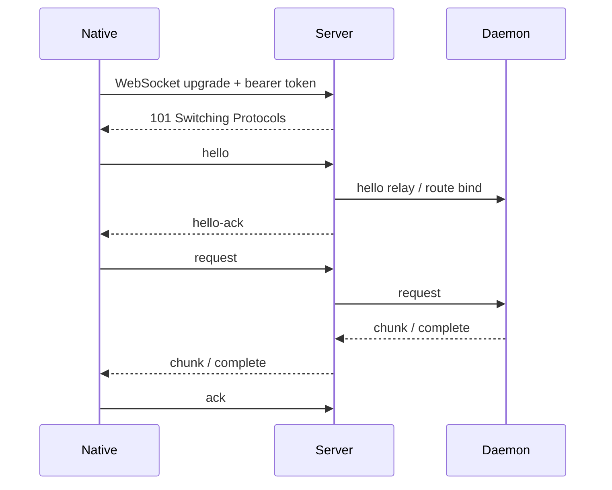

# Machine Data Plane Protocol v1

Status: in progress

This document defines the target protocol for Unhappy's encrypted machine data plane. It replaces large-payload Socket.IO RPC for sensitive machine operations with a standard WebSocket transport and a language-neutral frame protocol.

This spec is intended to work across:
- iOS native (`URLSessionWebSocketTask`)
- daemon implementations in TypeScript, Go, or Rust
- future desktop clients

It does not require a custom WebSocket library. The transport is standard WebSocket. The custom part is the protocol carried over that socket.

For the current protocol surface, see [protocol.md](/Users/skyline23/Downloads/unhappy/docs/protocol.md). For encrypted payload formats, see [encryption.md](/Users/skyline23/Downloads/unhappy/docs/encryption.md).

## Goals

- Keep the server blind to sensitive machine payloads.
- Remove large-payload dependence on Socket.IO request/ack limits.
- Make the data plane portable across Swift, TypeScript, Go, and Rust.
- Keep control plane and data plane explicitly separated.
- Support chunking, pagination, acknowledgements, and resumable streams without transport-specific behavior.

## Non-Goals

- Replacing the existing control plane.
- Replacing session/account/artifact update fanout.
- Introducing a binary-only protocol before JSON framing proves insufficient.

## Plane Split

### Control Plane

Still allowed over HTTP or small Socket.IO events:
- machine register / metadata / daemon state sync
- machine online/offline
- model catalog
- daemon stop / daemon update
- user/session/artifact sync

### Data Plane

Must use this protocol:
- transcript and direct-message load/send
- file read/write
- directory listing / tree
- shell commands
- ripgrep
- diff / patch tools
- project open/remove/list if paths are involved
- provider session spawn/open operations that include local path or prompt data

## Transport

- Scheme: `wss://`
- Path template: `/v1/machines/:machineId/data-plane`
- WebSocket subprotocol: `unhappy-machine-dp.v1`
- Payload framing: JSON text frames
- Sensitive bodies: encrypted and encoded as base64url strings inside JSON frames

The protocol intentionally avoids Socket.IO semantics. No event names, no rooms, no ack callbacks. Only raw WebSocket frames.

## Open-Source Security Requirement

This protocol must remain secure even when:
- the full source code is public
- frame shapes are public
- operation names are public
- attackers know exact chunk sizes, retry behavior, and error codes

Security must depend only on:
- bearer-token authentication to the server
- possession of the machine data encryption key
- ephemeral key material generated per connection

No part of the design may rely on hidden route names, hidden frame formats, or undocumented client behavior.

## Authentication and Binding

The opening WebSocket request must include:
- `Authorization: Bearer <token>`
- machine identifier in the path
- subprotocol `unhappy-machine-dp.v1`

The server must:
- authenticate the bearer token
- verify the token owner can access `machineId`
- bind the connection to `(userId, machineId, role)`
- remain blind to encrypted frame bodies

The daemon and native app both connect through the server. The server acts as an authenticated relay, not a decrypting endpoint.

## Key Agreement

The long-lived machine data encryption key is not used directly as the frame cipher key.

Instead, both peers derive a per-connection session key:

1. Native generates an ephemeral X25519 keypair and a random 32-byte nonce.
2. Daemon generates an ephemeral X25519 keypair and a random 32-byte nonce.
3. Both sides exchange ephemeral public keys and nonces in `hello` / `hello-ack`.
4. Both sides compute:

```
sharedSecret = X25519(ephemeralPrivateKey, peerEphemeralPublicKey)
sessionKey = HKDF-SHA256(
  ikm = sharedSecret || machineDataKey,
  salt = clientNonce || daemonNonce,
  info = "unhappy.machine-data-plane.session.v1",
  outputLength = 32
)
```

Properties:
- the machine data key authenticates the session
- the X25519 exchange gives forward secrecy
- the derived session key is unique per connection
- replaying old encrypted frames across connections must fail

## Connection Lifecycle



The first client frame must be `hello`.

The server responds with `hello-ack`.

After `hello-ack`, the client may send `request` frames and the server may relay `chunk`, `complete`, or `error`.

## Frame Model

All frames share:

```json
{
  "v": 1,
  "t": "frame-type"
}
```

### `hello`

Sent by the connecting side.

```json
{
  "v": 1,
  "t": "hello",
  "connectionId": "uuid",
  "role": "native",
  "keyExchange": {
    "algorithm": "x25519-hkdf-sha256",
    "publicKey": "<base64url 32 bytes>",
    "nonce": "<base64url 32 bytes>"
  },
  "supportsChunkAck": true,
  "supportsResume": true,
  "lastAckedStreamId": null
}
```

Fields:
- `connectionId`: caller-generated identifier for observability and resume correlation
- `role`: `native` or `daemon`
- `keyExchange`: ephemeral key agreement material
- `supportsChunkAck`: whether the peer understands `ack`
- `supportsResume`: whether the peer can resume streams
- `lastAckedStreamId`: optional cursor for resume support

### `hello-ack`

Returned after validation.

```json
{
  "v": 1,
  "t": "hello-ack",
  "connectionId": "uuid",
  "sessionId": "uuid",
  "keyExchange": {
    "algorithm": "x25519-hkdf-sha256",
    "publicKey": "<base64url 32 bytes>",
    "nonce": "<base64url 32 bytes>"
  },
  "maxChunkBytes": 262144,
  "maxInFlightStreams": 8,
  "idleTimeoutSeconds": 45
}
```

Fields:
- `sessionId`: server-generated connection session identifier
- `keyExchange`: responder ephemeral key agreement material
- `maxChunkBytes`: maximum encrypted body size per chunk
- `maxInFlightStreams`: per-connection concurrency budget
- `idleTimeoutSeconds`: server idle timeout expectation

### `request`

Starts one logical stream.

```json
{
  "v": 1,
  "t": "request",
  "streamId": "uuid",
  "op": "codex.listMessages",
  "body": {
    "algorithm": "aes-256-gcm",
    "nonce": "<base64url 12 bytes>",
    "ciphertext": "<base64url>",
    "tag": "<base64url 16 bytes>"
  },
  "expectsChunks": true
}
```

Fields:
- `streamId`: client-generated request/response correlation identifier
- `op`: operation name
- `body`: encrypted JSON request payload
- `expectsChunks`: whether the caller accepts chunked responses

### `chunk`

Carries one response chunk for a stream.

```json
{
  "v": 1,
  "t": "chunk",
  "streamId": "uuid",
  "seq": 1,
  "body": {
    "algorithm": "aes-256-gcm",
    "nonce": "<base64url 12 bytes>",
    "ciphertext": "<base64url>",
    "tag": "<base64url 16 bytes>"
  },
  "final": false
}
```

Fields:
- `seq`: monotonically increasing chunk sequence within `streamId`
- `body`: encrypted JSON payload chunk
- `final`: reserved convenience bit; `complete` is still required for stream closure

### `complete`

Closes a stream successfully.

```json
{
  "v": 1,
  "t": "complete",
  "streamId": "uuid",
  "seq": 3,
  "body": {
    "algorithm": "aes-256-gcm",
    "nonce": "<base64url 12 bytes>",
    "ciphertext": "<base64url>",
    "tag": "<base64url 16 bytes>"
  },
  "hasMore": false,
  "nextCursor": "opaque-cursor"
}
```

Fields:
- `body`: encrypted JSON final response object
- `hasMore` / `nextCursor`: application-level pagination state

### `error`

Closes a stream unsuccessfully.

```json
{
  "v": 1,
  "t": "error",
  "streamId": "uuid",
  "code": "stream_not_available",
  "message": "Provider session is not active",
  "retryable": false
}
```

### `ack`

Acknowledges receipt of streamed chunks.

```json
{
  "v": 1,
  "t": "ack",
  "streamId": "uuid",
  "seq": 2
}
```

The sender may use `ack` for flow control and resume bookkeeping. `ack` is required for chunked responses, optional for single-frame completes.

## Operation Names

Operation names are language-neutral dotted identifiers.

Initial required set:
- `provider.spawn`
- `project.list`
- `project.open`
- `project.remove`
- `codex.listThreads`
- `codex.openThread`
- `codex.listMessages`
- `codex.sendMessage`
- `claude.listSessions`
- `claude.listMessages`
- `claude.sendMessage`
- `gemini.listSessions`
- `gemini.listMessages`
- `gemini.sendMessage`
- `fs.listDirectory`
- `fs.getDirectoryTree`
- `fs.readFile`
- `fs.writeFile`
- `exec.bash`
- `search.ripgrep`
- `diff.difftastic`

Control-plane commands such as `list-models`, `stop-daemon`, and `update-daemon` remain outside this protocol.

## Frame Encryption

The WebSocket transport itself only provides TLS. End-to-end privacy comes from the encrypted `body` field inside frames.

Rules:
- `body` uses the per-connection `sessionKey`, not the long-lived machine key directly
- `algorithm` is fixed to `aes-256-gcm`
- `nonce` must be unique per encrypted frame
- `ciphertext` and `tag` are base64url encoded
- the server must never decrypt frame bodies

Required integrity rule:
- header fields excluding `body` are authenticated as additional authenticated data
- the body is rejected if the header/body binding fails
- a frame with a duplicate `(streamId, seq)` on the same connection is rejected
- a frame from an old connection must fail because it was derived from a different session key

This lets the server route frames while remaining blind to prompt contents, file paths, transcript bodies, and tool output.

## Chunking and Pagination

The protocol solves the current transcript timeout issue by design.

Rules:
- large responses are split into `chunk` frames
- each chunk must respect `maxChunkBytes`
- paginated operations return `complete.hasMore` and `complete.nextCursor`
- initial transcript fetch should request the latest page only
- older history is loaded by sending another `request` with `nextCursor`

## Error Semantics

- Transport failure closes the socket and invalidates in-flight streams.
- Stream failure uses an `error` frame and only fails that `streamId`.
- `retryable` is advisory and should only be `true` for transient routing, timeout, or backpressure conditions.

## Backpressure

The server and daemon may limit:
- max in-flight streams
- max chunk bytes
- max buffered outbound bytes per connection

If a sender exceeds limits, the receiver may:
- delay reads until `ack`
- return `error` with `retryable: true`
- close the connection on abusive behavior

## Replay and Abuse Defenses

- Each direction must maintain monotonically increasing `seq` within a `streamId`.
- The receiver keeps a bounded replay window per stream and rejects duplicates.
- `hello` and `hello-ack` are single-use for a connection.
- Bearer token auth only grants routing permission; it does not replace E2E encryption.
- The server should rate-limit connection attempts and concurrent streams per `(userId, machineId)`.
- The daemon should reject operations outside the allowed data-plane operation set.

## Resume

Resume is optional in v1, but the frame surface reserves it.

Expected behavior:
- `streamId` is stable across reconnect for retried stream fetches
- `ack.seq` records last processed chunk
- `hello.lastAckedStreamId` allows the server/daemon to decide whether replay is possible

If resume is not possible, the caller retries from application cursor state.

## Migration Plan

1. Freeze this spec and frame names.
2. Land shared protocol types in native and TypeScript.
3. Add a dedicated machine data-plane WebSocket endpoint on the server.
4. Implement daemon support for `hello`, `request`, `chunk`, `complete`, `error`, and `ack`.
5. Migrate `codex.listMessages` first.
6. Migrate `claude.listMessages` and `gemini.listMessages`.
7. Migrate file/bash/search/diff operations.
8. Remove sensitive Socket.IO `rpc-call` usage from native and daemon.

## Why Standard WebSocket

Standard WebSocket is the right base because:
- it is available on iOS, Go, Rust, and Node
- it does not impose Socket.IO framing or buffer policy
- the custom part is only the protocol, which we control
- server and daemon implementations can change languages without changing the wire contract
